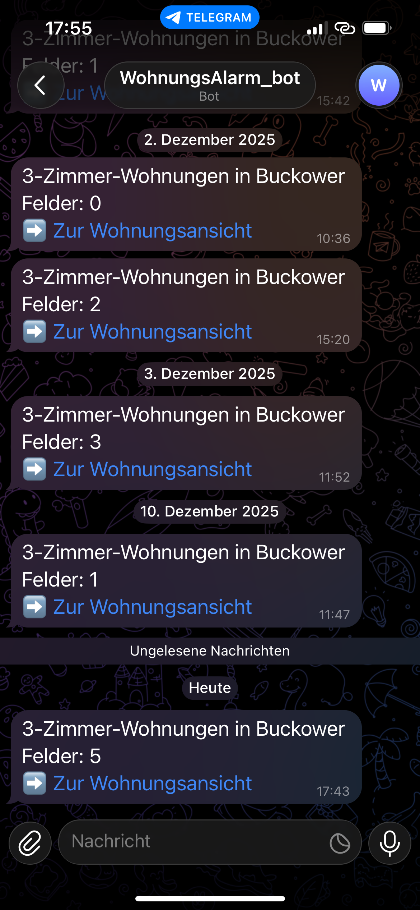
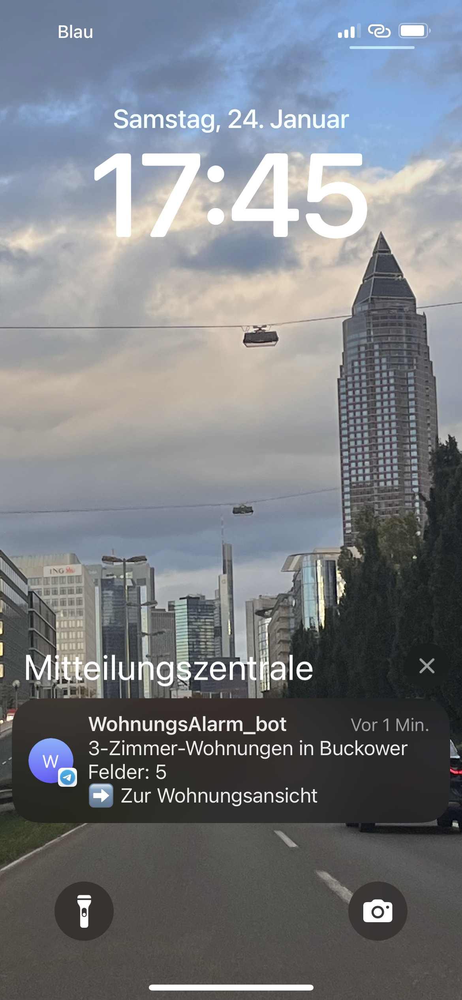

# Automated Change Detection & Notification System

An automated end-to-end workflow that monitors a real estate website for new apartment listings based on predefined criteria such as location and number of rooms, and sends real-time notifications via Telegram.

---

## 🚀 About the Project

This project was created to automate the process of monitoring real estate listings and to demonstrate practical skills in automation, CI/CD, and system integration.

It runs fully automated and provides real-time notifications when relevant changes are detected.

---

## 🎯 Why this project?

The goal of this project was to design and implement a reliable automation workflow that demonstrates:

- Automation of repetitive tasks
- Change detection and validation logic
- CI/CD-based execution
- Event-driven notifications
- Monitoring and alerting concepts

The project reflects real-world use cases in QA Automation, Platform Engineering, and DevOps environments.

---

## 🛠 Tech Stack

- **Python**
- **Playwright** (Browser Automation)
- **GitHub Actions** (CI/CD & Scheduling)
- **Telegram Bot API** (Notifications)
- **YAML** (Workflow Configuration)

---

## ⚙️ How it works

1. A Playwright-based Python script navigates the target website and extracts relevant listing data.
2. The extracted data is compared with previous results to detect changes.
3. The workflow is executed automatically via GitHub Actions using scheduled and manual triggers.
4. When a new listing or change is detected, a notification is sent via the Telegram Bot API.

---

## 🔄 CI/CD Automation

The workflow runs fully automated in a CI/CD environment using GitHub Actions.  
It supports both scheduled execution (cron-based) and manual triggering via workflow dispatch.

---

## 📸 Example Notifications

  
  

---

## 📚 Key Learnings

- Designing reliable automation workflows
- Working with browser automation using Playwright
- Implementing CI/CD pipelines with GitHub Actions
- Integrating external APIs (Telegram Bot API)
- Applying monitoring and alerting principles
- Writing maintainable and structured automation code

---

## 📝 Notes

This project focuses on automation concepts, workflow reliability, and integration patterns rather than on the specific content being monitored.
